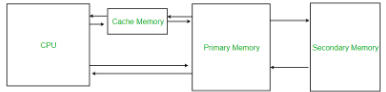
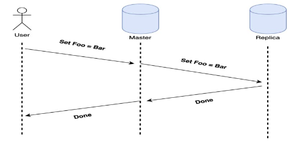
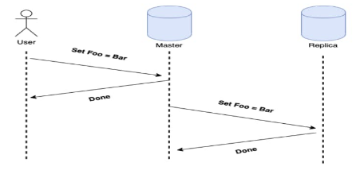
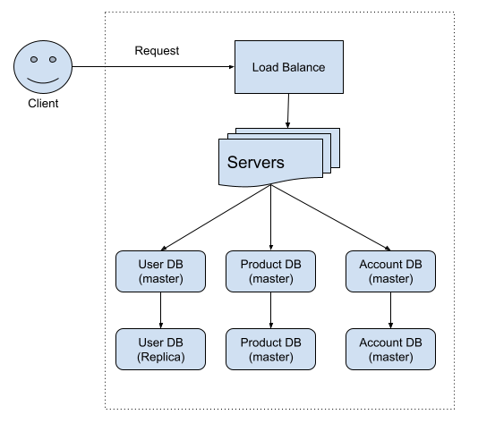
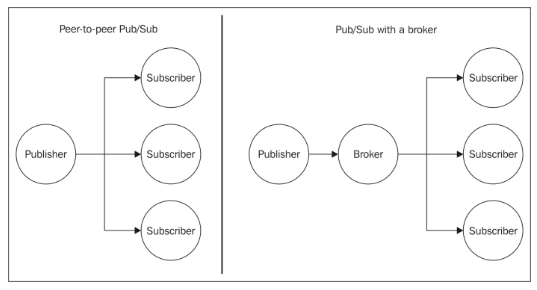
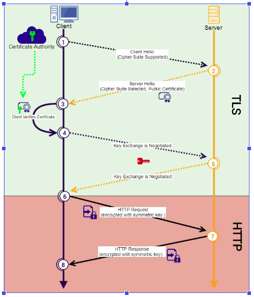
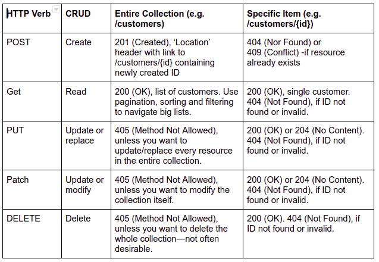

<!--
*** Thanks for checking out the Best-README-Template. If you have a suggestion
*** that would make this better, please fork the repo and create a pull request
*** or simply open an issue with the tag "enhancement".
*** Thanks again! Now go create something AMAZING! :D
-->


<!-- PROJECT SHIELDS -->
<!--
*** I'm using markdown "reference style" links for readability.
*** Reference links are enclosed in brackets [ ] instead of parentheses ( ).
*** See the bottom of this document for the declaration of the reference variables
*** for contributors-url, forks-url, etc. This is an optional, concise syntax you may use.
*** https://www.markdownguide.org/basic-syntax/#reference-style-links
-->
<!-- [![Contributors][contributors-shield]][contributors-url] -->
<!-- [![Forks][forks-shield]][forks-url] -->
<!-- [![Stargazers][stars-shield]][stars-url] -->
<!-- [![Issues][issues-shield]][issues-url] -->
<!-- [![MIT License][license-shield]][license-url] -->
<!-- [![LinkedIn][linkedin-shield]][linkedin-url] -->


<!-- PROJECT LOGO -->
<br />
<p align="center">
  <a href="https://github.com/othneildrew/Best-README-Template">
    
  </a>

  <h3 align="center">Best-README-Template</h3>

  <p align="center">
    An awesome README template to jumpstart your projects!
    <br />
    <a href="https://github.com/othneildrew/Best-README-Template"><strong>Explore the docs »</strong></a>
    <br />
    <br />
    <a href="https://github.com/othneildrew/Best-README-Template">View Demo</a>
    ·
    <a href="https://github.com/othneildrew/Best-README-Template/issues">Report Bug</a>
    ·
    <a href="https://github.com/othneildrew/Best-README-Template/issues">Request Feature</a>
  </p>
</p>


<!-- TABLE OF CONTENTS -->
<details open="open">
  <summary>Table of Contents</summary>
  <ol>
    <li>
      <a href="#about-the-project">Topics</a>
      <ul>  
        <li><a href="#client-server-model1">Client-Server Model</a></li>
        <li><a href="#network-protocols">Network Protocols</a></li>
        <li><a href="#storage">Storage</a></li>
        <li><a href="#latency-and-throughput">Latency &Throughput</a></li>
        <li><a href="#availability">Availability</a></li>
        <li><a href="#caching">Caching</a></li>
        <li><a href="#proxies">Proxies</a></li>
        <li><a href="#load-balancer">Load Balancers</a></li>
        <li><a href="#hashing">Hashing</a></li>
        <li><a href="#relational-databases">Relational Databases</a></li>
        <li><a href="#key-value-stores">Key-Value Stores</a></li>
        <li><a href="#specialized-storage-paradigms">Specialized Storage Paradigms</a></li>
        <li><a href="#replication-and-sharding">Replication & Sharding</a></li>
        <li><a href="#leader-election">Leader Election</a></li>
        <li><a href="#peer-to-peer-networks">Peer-to-Peer Networks</a></li>
        <li><a href="#polling-and-streaming">Polling and Streaming</a></li>
        <li><a href="#configuration">Configuration</a></li>
        <li><a href="#rate-limiting">Rate Limiting</a></li>
        <li><a href="#logging-and-monitoring">Logging and Monitoring</a></li>
        <li><a href="#publish-subscribe-patterns">Publish/Subscribe Patterns</a></li>
        <li><a href="#map-reduce">MapReduce</a></li>
        <li><a href="#security-and-https">Security and HTTPS</a></li>
        <li><a href="#api-design">API Design</a></li>
        <li><a href="#messaging-tool">Messaging Tool</a></li>  
      </ul>
    </li>
    <li>
      <a href="#getting-started">How To Guides</a>
      <ul>
        <li><a href="#">How to deploy NodeJS on DigitalOcean for production</a></li>
      </ul>
    </li>
        <li>
      <a href="#getting-started">Git</a>
      <ul>
        <li><a href="#">upload to remote</a></li>
      </ul>
    </li>
    
  </ol>
</details>


<!-- CLIENT-SERVER MODEL -->
## Client-Server Model1

![Product Name Screen Shot][product-screenshot]

### Client 
A Machine or process the request data or service from a server.
### Server
A machine or process that provides data or service for a client, usually by listening for incoming network calls.

Note: a single machine or piece of software can be both a client and a server at the same time. For instance, a single machine could act as a server for an end user and as a client for a database.

Client-Server Model is a paradigm by which modern web systems are designed, which consist of clients requesting data or service from servers and servers responds to the request.

IP Address an address given to each machine on the internet/LAN networks. Special values include:
* 127.0.0.1 - your own local machine, also referred as localhost
* 192.168.x.y - Private network and machine segments. All machines on the private network will usually have the 192.168 prefix.
* Port - In order for multiple programs to listen for new network connections on the same machine without colliding with each other the pick a port to listen on. A port is an integer between 0 and 65535 (216)  

Typically, ports 0-1023 are reserved for system ports (called well-known ports) and shouldn’t be used by user-level processes. For example:
* 22: Secure Shell
* 53: DNS lookup
* 80: HTTP
* 443: HTTPS

DNS - Short for Domain Name System, it describes the entities and protocols involved in the translation from domain names (www.google.com) to IP addresses. 
Typically, machines make a DNS query to a well known entity (such as ISP) which is responsible for returning the (actual) IP address (or multiple ones) of the requested domain name in the response.


### How to make DNS query (on linux Terminal):
```sh
$ dig www.google.com
```

### How to read/write to network connections using NetCat
Terminal-1:
```sh
$ Nc -l 8081
```
Terminal-2
```sh
$ Nc 127.0.0.1 8081
```


<!-- NETWORK-PROTOCOLS -->
## Network Protocols

![Product Name Screen Shot][network-protocols]
<p align="center">
IP packets. TCP headers. HTTP requests
</p>
### IP
Stands for Internet Protocol. This network protocol outlines how almost all machine-to-machine communications should happen in the world. Other protocols like TCP, UDP and HTTP are built on top of IP.

### TCP 
Network protocol built on top of Internet Protocol (IP). Allows for ordered, reliable data delivery between machines over the public internet by creating a connection.

TCP is implemented in the OS kernel, which exposes sockets to applications that they can use to stream data through an open connection. 
Socket
A kind of a file that acts like a stream. Processes can read  and write to socket and communicate in this manner. Most of the time sockets are fronts for TCP connection.

### HTTP
The HyperText Transfer Protocol is a very common network protocol implemented on top of TCP. Clients makeHTTP requests, and servers respond with a response. 

### Requests typically have the following schema:

host: string (example: www.google.com)
port : integer (example 80 or 443)
method: string  (example GET, PUT, POST, DELETE, OPTIONS or PATCH)
headers: pair list (example: ”Content-Type” => ”application/json”)
body opaque sequence of bytes

### Response typically have the following schema:

### Status code: integer (example:200, 401)
headers: pair list (example: ”Content-Length” => ”1123”)
body opaque sequence of bytes

### IP Packets
Sometimes more broadly referred to as just a (network) packet, an IP packet is effectively the smallest unit used to describe data being sent over IP, aside from bytes. An IP packet consist of:
An IP header, which contains the source and destination IP addresses as well as other information related to the network
A payload,  which is just the data being sent over the network 


<!-- STORAGE -->
## Storage

<!-- ![Product Name Screen Shot][cache] -->
<p align="center">
    
    <br/>IP packets. TCP headers. HTTP requests
</p>

### Databases
Databases (DB) are programs that either use disk or memory to do 2 core things: record data and query data. In general, they are themselves servers that are long lived and interact with the rest of your application through network calls, with protocols on top of TCP or even HTTP.

Some databases only keep records in memory, which means that those records may be lost if the machine or process dies.

For the most part though, databases need persistence of those records, and thus cannot use memory, which means the data must be written to a disk. 

Since machines die often in a large scale systems, special disk partitions or volumes are used by the database processes, and those volumes can get recovered even if the machine were to go down permanently. 

### Disk
Usually refers to HDD (Hard-disk drive) or SSD (Solid-State drive). 
Data written to disk will persist through power failures and general machine crashes. 
Disk is also referred to as non-volatile storage. 

SSD is far faster (and hence more expansive) than HDD. because of that, HDD will typically be used for data that’s rarely accessed or updated, but that’s stored for a long time, and SSD will be used for data that’s frequently accessed and updated. 

### Memory
Short for Random Access Memory (RAM). Data stored in memory will be lost when the process that has written that data dies.

### Cache (Memory)
Is a special very high-speed memory located inside a CPU chip. It is used to speed up the machine. Cache memory is used to reduce the average time to access data from the Main memory. The cache is a smaller and faster memory which stores copies of the data from frequently used main memory locations. There are various different independent caches in a CPU, which store CPU instructions and data.


[![Product Name Screen Shot][CACHE]]()
<p align="center">

IP packets. TCP headers. HTTP requests
</p>


### Persistent Storage
Usually refers to a disk, but in general it’s any form of storage that persists if the process/MACHINE in charge of managing it dies. 


<!-- LATENCY-AND-THROUGHPUT -->
## Latency And Throughput 

### Latency 
The time it takes for a certain operation to complete in a system. Most often this measure is a time duration.
### Throughput
The number of operations that a system can handle properly per time of unit. For instance the throughput of a server can often be measured in requests per second (RPS or QPS).


<!-- AVAILABILITY -->
## Availability

### Process
A program that is currently running on a machine. You should always assume that any process may get terminated at any time in a sufficiently large system. 

Node/Instance/Host
These 3 terms refer to the same thing most of the time: a virtual or physical machine on which the developer runs processes. Sometimes the word server also refers to this same concept.
### Availability
The odds of a particular server or service being up and running at any point in time, usually measured in percentages. A server that has 99% availability will operate 99% of the time (this would be described as having two nines of availability)
High availability (HA)
Used to describe systems that have particularly high levels of availability, typically 5 nines or more.

### Nines
Typically refers to percentages of up time. For example, 5 nines of availability means an uptime of 99.999% of the time. Below are the downtimes expected per year depending on thouse 9s:
99% 		(two 9s): 87.7 hours
99.9% 		(three 9s): 8.8 hours
99.99%: 	52.6 minutes
99.999%:	5.3 minutes (Highly available system has minimum five 9s)

### Redundancy
The process of replicating parts of a system in an effort to make it more reliable/available.

### SLA (Service-level Agreement)
SLA is a collection of guarantees given to a customer by a service provider. SLAs typically make guarantees on a system’s availability, amongst other measurable metrics like responsiveness and responsibilities. SLAs are made up of one or multiple SLOs. 

### SLOs (Service-level Objective) 
The objectives that make an agreement (SLA) which the team must hit to meet that agreement.

### SLIs
The actual measured numbers/performance


<!-- CACHING -->
## Caching

### Cache
A piece of hardware or Software that stores data, typically meant to retrieve that data faster than otherwise. 

Caches are often used to store responses to network request as well as results of computationally-long operation

Note that data in a cache can become stale if the main source of truth for that data (i.e. the main database behind the cache) gets updated and the cache doesn’t.

### Cache Hit
When requested data is found in a cache. 

### Cache Miss
When requested data could have been found in a cache but isn’t. This is typically used to refer to a negative consequence of a system failure or of a poor design choice. 


For example: if the server goes down, our load balancer will have to forward requests to a new server, which will result in a cache miss. 

### Cache eviction Policy
The set of rules (a policy) by which values get evicted or removed from a cache. Popular cache evictions include LRU (Least-recently used), FIFO (First In First Out) and, LFU (Least-Frequently used).

### CDN (Content Delivery Network)
A CDN is a 3rd party service that acts like a cache for a web application. 
Web applications can be slow for users located in different regions than the server of the application system. A CDN has servers all around the world, meaning that the latency to a CDN’s servers will almost always be far better than the latency to your server. 
A CDN’s servers are often referred to as PoPs (Point of Presence). Two of the most popular CDNs are Cloudflare and Google Cloud CDN.


<!-- PROXIES -->
## Proxies

### (Forward) Proxy
A server that sits between a client and a server and acts on behalf of the client, typically used to mask the client’s identity (IP address) or mask access to specific web sites. 

Note: forward proxies are often referred to as just proxies. 

### Reverse Proxy
A server that sits between a client and a server and acts on behalf of the server, typically used for logging, load balancing or caching.

### Nginx
A popular web server that’s often used as a reverse proxy and load balancer.


<!-- LOAD_BALANCER -->
## Load Balancers

Distributing network requests across multiple servers, these digital traffic cops act as watchful guardians for your system, ensuring that it operates at peak performance day and night.

### Load Balancer
A type of reverse proxy that distributes traffic across servers. Load balancers can be found in many parts of a system, from the DNS layer all the way to the database layer.

### Server-Selection Strategy
How a load balancer chooses servers when distributing traffic amongst multiple servers. Commonly used strategies include:
* Round-robin
* Random selection
* (user) IP-based routing
* API-based routing
* Performance-based selection (choosing the server with the best performance metrics, like the fastest response time or the least amount of traffic), 

### Hot Spot
Distribution of a workload across a set of servers might be spread unevenly. This can happen if your sharding key or your hashing function are suboptimal, or if your workload is naturally skewed; some servers will receive a lot more traffic than others, thus creating a “hot spot”.


<!-- HASHING -->
## Hashing

### Hashing Function
A hash function is any function that can be used to map data of arbitrary size to fixed-size values. The values returned by a hash function are called hash values, hash codes, digests, or simply hashes. The values are usually used to index a fixed-size table called a hash table.
Different inputs may have the same output, but a good hashing function attempts to minimize those hashing collisions.

### Consistent Hashing
A type of hashing that minimizes the number of keys that need to be remapped when a hash table gets resized. It’s often used by load balancers to distribute traffic to server; it minimizes the number of requests that get forwarded to different servers when new servers are added or when existing servers are brought down.
### Rendezvous Hashing
A type of hashing also named highest random weight hashing. Allows for minimal re-distribution of mappings when a server goes down.

https://medium.com/i0exception/rendezvous-hashing-8c00e2fb58b0

### SHA (Secure Hash Algorithms)
A collection of cryptographic hash functions used in the industry. These days, SHA-3 is a popular choice to use in a system.


### Usage Of Hash Functions:
* Data integrity - verify the integrity of files/ documents/ messages etc. a SHA256 checksum may confirm that certain file is original (i.e. not modified after its initiale checksum was calculated)
* Storing Passwords - Storing passwords and verification of passwords. Instead of keeping a plain-text password in the database, developers usually keep password hashes derived from the password.
* Generate Unique ID - Generate an (almost) unique ID of a certain document. Cryptographic hash functions almost uniquely identify documents based on their content. In theory collisions are possible with any cryptographic hash function, but are very unlikely to happen, so most systems (like Git) assume that the hash function they use is collision free.
* Pseudorandom Number Generation -  Pseudo Random generation and key derivation. Hash values can serve as random numbers. A simple way to generate a random sequence is like this: start from a random seed (entropy collected from random events, such as keyboard clicks or mouse moves). Append "1" and calculate the hash to obtain the first random number, then append "2" and calculate the hash to obtain the second random number, etc. We shall give a Python example, implementing the described idea.
* Proof-of-Work Algorithms - Proof-of-work (PoW) algorithms. Most proof-of-work algorithms calculate a hash value which is bigger than a certain value (known as mining difficulty). To find this hash value, miners calculate billions of different hashes and take the biggest of them, because hash numbers are unpredictable. For example, the proof of work problem might be defined as follows: find a number p, such that hash(x + p) holds 10 zero bits at its beginning. 
In other words, for a given value x find value p such that hash(concatenate(x,p)) will generate a hash value h which is less than h_limit. Because the hash() function is deterministic but unpredictable it will output a random 256 bit value if limit this output to have some values 

Link: https://cryptobook.nakov.com
 


<!-- RELATIONAL-DATABASES -->
## Relational Databases

### Relational Database
A type of structured database in which data is stored following a tabular format; often supports powerful querying using SQL.

### SQL
Structured Query Language. Relational databases can be used using a derivative of SQL such as PostgreSQL in the case of Postgres.
### SQL Database
Any database that supports SQL. This term is often used synonymously with “Relational Database”, though in practice, not every relational database supports SQL. 
### Non-Relational Database
In contrast with SQL databases, a type of database that is free of imposed, tabular-like structure. Often referred to as NoSQL.
### NoSQL Database
ANy database that is not SQL-compatible is called NoSQL.

### ACID Transaction
A type of database transaction that has four important properties:

* Atomicity: The operations that constitute the transaction will either all succeed or all fail. There is no in-between state. 
* Consistency: The transaction can’t bring the database to an invalid state. After the transaction is committed or rolled back, the rules for each record will still apply, and all future transactions will see the effect of the transaction. Also named Strong Consistency. 
* Isolation: The execution of multiple transactions concurrently will have the same effect as if they had been executed sequentially. 
* Durability: Any committed transaction is written to non-volatile storage. It will not be undone by a crash, power loss, or network partition.


### Database Index
A special auxiliary data structure that allows your database to perform certain queries much faster.  You create an index on one or multiple columns in your database to greatly speed up read queries that you run very often, with the downside of slightly longer writes, since writes have to also take place in the relevant index. 

### Strong Consistency
Strong Consistency usually refers to the consistency of ACID transactions, as opposed to Eventually Consistency. 

### Eventually Consistency
A consistency model which is unlike Strong Consistency. In this model, reads might return a view of the system that is stale. An eventually consistent datastore will give guarantees that the state of the database will eventually reflect writes with in a time period (seconds or minutes).

### Postgres 
A relational database that uses a dialect of SQL called PostgreSQL. Provides ACID transactions. 


<!-- KEY-VALUE-STORES -->
## Key-Value Stores
One of the most commonly used NoSQL paradigms today, the key-value store bases itd data model on the associative array data type.  It is a fast, flexible storage machine that resembles a hash table. 
Key-Value (KV) Store
A flexible NoSQL database that’s often used for caching and dynamic configuration. Popular options include:
* DynamoDB
* Etcd
* Redis 
* ZooKeeper

### Etcd
A strongly consistent and highly available key-value store that’s often used to implement leader election in a system

### Redis
An in-memory key-value store. Does offer some persistent storage options but is typically used as a really fast, best-effort caching solution. Redis is also used to implement rate limiting.

### ZooKeeper
A strongly consistent and highly available key-value store that’s often used to store important configurations or to perform leader election.

### LevelDB
An open-source on-disk key-value store written by Google fellows.


<!-- SPECIALIZED-STORAGE-PARADIGMS -->
## Specialized Storage Paradigms

### Blob Storage
Widely used king of storage, in small and large scale systems. They don’t really count as databases per se, partially because they only allow the user to store and retrieve data based on the name of the blob (like a regular file in an operating system). 
This is sort of like a key-value store but usually blob stores have different guarantees. They might be slower than KV stores but values can be megabytes large (or gigabytes). 
Usually people use this to store things like large binaries, database snapshots, or images and other static assets that a website might have. 

Blob storage is rather complicated to have on-premise (on application servers) and only big companies like Google (GCS - Google Cloud Storage ) and Amazon (S3) have the infrastructure to support it.
### Time Series Database (TSDB)
Is a special kind of database optimized for storing and analyzing time-indexed data: data points that specifically occur at a given moment in time. Examples of TSDBs are:
* influxDB
* Prometheus
* Graphite

### Graph Database
A type of database that stores data following the graph data model. Data entries in a graph database can have explicitly defined relationships, much like nodes in a graph can have edges.

Graph databases take advantage of their underlying graph structure to perform complex queries on deeply connected data very fast. 

Graph databases are thus often preferred to relational databases when dealing with systems where data points naturally form a graph and have multiple levels of relationships - i.e. social networks.
### Cypher
A graph query language that was originally developed for the Neo4j graph database, but that has since been standardized to be used with other graph databases in an effort to make it the “SQL for graphs”.


### Spatial Database
A type of database optimized for storing and querying spatial data like locations on a map. Spatial databases rely on spatial indexes like quadtrees to quickly perform spatial queries like finding all locations in the vicinity of a region. 

#### Quadtrees
A tree data structure most commonly used to index two-dimensional spatial data. Each node in a quadtree has either zero children nodes (and is therefore a leaf node) or exactly four children nodes. 

Typically, quadtree nodes contain some form of spatial data - for example, locations on a map - with a maximum capacity of some specified number n. So long as nodes aren’t at capacity, they remain leaf nodes; once they reach capacity, they’re given four children noes, and their data entries are split across the four children nodes. 

A quadtree lends itself well to storing spatial data because it can be represented as a grid filled with rectangles that are recursively subdivided into four sub-rectangles, where each quadtree node is represented by a rectangle and each rectangle represents a spatial region. Assuming we’re storing location in the world, we can imagine a quadtree with a maximum node-capacity n as follows:
*   The root node, which represents the entire world, is the outermost rectangle. 
If the entire world has more than n locations, the outermost rectangle is divided into four quadrants, each representing a region of the world. 
* So long as a region has more than n locations, its corresponding rectangle is subdivided into four quadrants (the corresponding node in the quadtree is given four children nodes).
* Regions that have fewer than n locations are undivided rectangles (leaf nodes)

Finding a given location in a perfect quadtree is an extremely fast operation that runs in log4(x) time (where x is the total number of locations), since quadtree nodes have four children nodes. 

### Google Cloud Storage (GCS)
A blob storage service provided by Google.

### S3 
A blob storage service provided by Amazon Web Services (AWS).

### InfluxDB
A popular open-source time series database. 
### Prometheus 
A popular open-source time series database, typically used for monitoring purposes. 

### Neo4j
A popular graph database that consists of nodes, relationships, properties, and labels.
 


<!-- REPLICATION-AND-SHARDING -->
## Replication And Sharding
A system’s performance is often only as good as its database; optimized the latter, and the former will improve as well.

### Replication
The act of duplicating the data from one database to others. This is sometimes used to increase the redundancy of a system and tolerate regional failures for instance. Other times you can use replication to move data closer to your clients, thus decreasing the latency of of accessing specific data.
### Sharding
Sometimes called data partitioning, sharding is the act of splitting a database into two or more pieces called shards and is typically done to increase the throughput of your database. Popular sharding strategies include:
* Sharding based on a client’s region
* Sharding based the type of data being stored (e.g: user data gets stored in one shard, payments data gets stored in another shard)
* Sharding based on the hash of a column (only for structured data)

<br/>Synchronous Replication:
<p align="center">
   
</P>

<br/>Asynchronous Replication:
<p align="center">
   
</P>

<br/>System Example:
<p align="center">
   
</P>


<!-- LEADER-ELECTION -->
## Leader Election

The process by which nodes in a cluster (i.e servers in a set of servers) elect a so-called “leader” amongst them, responsible for the primary operation of the service that these nodes support. When correctly implemented, leader election guarantees that all nodes in the cluster know which one is the leader at any given time and can elect a new leader if the leader dies for whatever reason.

### Consensus Algorithm
A type of (complex) algorithm used to have multiple entities agree on a single data value, like who the “leader“ is amongst a group of machines or whose blockchain is the main chain. 
Two popu;ar consensus algorithms are Paxos and Raft.

### Etcd
A strongly consistent and highly available key-value store that’s often used to implement leader election in a system

### ZooKeeper
A strongly consistent and highly available key-value store that’s often used to store important configurations or to perform leader election.


<!-- PEER-TO-PEER-NETWORKS -->
## Peer-To-Peer Networks

### Peer-To-Peer Network
A collection of machines referred to as peers that divide a workload between themselves to presumably complete the workload faster than would otherwise be possible. Peer-to-peer networks are often used in file-distribution systems.

### Gossip Protocol
When a set of machines talk to each other in an uncoordinated manner in a cluster to spread information through a system without requiring a central source for the data. 


<!-- POLLING-AND-STREAMING -->
## Polling and Streaming

### Polling 
The act of fetching a resource or piece of data regularly at an interval. 

### Streaming
In networking, it usually refers to the act of continuously getting a feed of information from a server by keeping an open connection between the two machines or processes. 


<!-- CONFIGURATION -->
## Configuration
A set of parameters or constants that are critical to a system. Configuration can be: 
Static - meaning that it’s hard-coded in and shipped within the application code,
Dynamic - meaning that it lives outside of your application code

* Static configuration example: is a JSON file which is included in the project folder and configures some application parameters.

* Dynamic configuration example: is environment variables which are provided to the process of the application when it is being called. For example port number on which server should listen or a secret value which is used to sign JWT token.


<!-- RATE-LIMITING -->
## Rate Limiting

The act of limiting the number or requests sent to or from a system/ Rate limiting is most often used to limit the number of requests to prevent DoS attacks and can be enforced at the IP-Address level, at the user-account level, or at the region level, for example. Rate limiting can also be implemented in tiers; for instance, a type of network request could be limited to 1 per second, where other network requests could be limited to 5 per 10 seconds.

### Denial-Of-service (DoS) Attack
An attack in which a malicious user tries to bring down or damage a system in order to make it unavailable to users. Much of the time it consists of flooding it with traffic. Some DoS attacks are easily preventable with rate limiting, while others can be far more trickier to defend against.

### Distributed Denial-Of-service (DDoS) Attack
A DoS attack in which the traffic flooding the target system comes from many different sources (like thousands of machines) making it much harder to defend against.


#### Why rate limiting is used
Rate limiting is generally put in place as a defensive measure for services. Shared services need to protect themselves from excessive use—whether intended or unintended—to maintain service availability. Even highly scalable systems should have limits on consumption at some level. For the system to perform well, clients must also be designed with rate limiting in mind to reduce the chances of cascading failure. Rate limiting on both the client side and the server side is crucial for maximizing throughput and minimizing end-to-end latency across large distributed systems.
(https://cloud.google.com/solutions/rate-limiting-strategies-techniques)
* Preventing resource starvation
* Managing policies and quotas
* Controlling flow
* Avoiding excess costs

#### Strategies 
* No rate limiting 
* Pass through 
* Enforce rate limits 
* Defer response 
* *Client-side strategies 

#### Techniques for enforcing rate limits
* Token bucket
* Leaky bucket
* Fixed windows

#### Additional techniques for greater resilience
Rate limiting at the application level can provide services with increased resilience, but resilience can be further improved by combining application-level rate limiting with other techniques:
* Caching 
* Circuit breaking 
* Prioritization
* Rate limiting at multiple layers


<!-- LOGGING-AND-MONITORING -->
## Logging and Monitoring

The act of limiting the number or requests sent to or from a system/ Rate limiting is most often used to limit the number of requests to prevent DoS attacks and can be enforced at the IP-Address level, at the user-account level, or at the region level, for example. Rate limiting can also be implemented in tiers; for instance, a type of network request could be limited to 1 per second, where other network requests could be limited to 5 per 10 seconds.

### Logging
The act of collecting and storing logs - useful info about events in your system. Typically your programs will output log messages to its STDOUT STDERR pipes, which will automatically get aggregated into a centralized logging solution.

### Monitoring
The process through which system admins get notified when critical system issues occur. Alerting can be set up by defining a specific threshold on monitoring charts, past which alerts are sent to a communication channel like Slack. 


<!-- PUB-SUB-PATTERN -->
## Publish/Subscribe Pattern 

Often shortened to Pub/Sub, is a popular messaging model that consists of publishers and subscribers. Publishers publish messages to special topics (sometimes called channels) without caring about or even knowing who will read those messages, and subscribers subscribe to topics and read messages coming through those topics.

<p align="center">
   
</P>


Pub/Sub systems often come with very powerful guarantees like at-least-once delivery, persistent storage, ordering (of messages) and replayability of messages.

### Idempotent Operation
An operation that has the same ultimate outcome regardless of how many times it’s performed. If an operation can be performed multiple times without changing its overall effect, it’s idempotent. Operations performed through a Pub/Sub messaging system typically have to be idempotent, since Pub/Sub systems tend to allow the same messages to be consumed multiple times.
For example, increasing an integer value in a database is NOT an idempotent operation, since repeating this operation will not have the same effect as if it had been performed only once. Conversely, setting a value to “COMPLETE” is an idempotent operation, since repeating this operation will always yield the same result: the value will be “COMPETE”.

### Apache Kafka
A distributed messaging system created by LinkedIn. Very useful when using the streaming paradigm as opposed to polling. 

### Cloud Pub/Sub
A highly-scalable Pub/Sub messaging service created by Google. Guarantees at-least-once delivery of messages and supports “rewinding” in order to reprocess messages.


<!-- MAP-REDUCE -->
## MapReduce 

MapReduce is a programming model for processing and generating big data sets with a parallel, distributed algorithm on a cluster”

### MapReduce
A popular framework for processing very large dataset =s in a distributed setting efficiently, quickly, and in a fault-tolerant manner. A MapReduce job is comprised of 3 main steps:
* The map step, which runs a map function on the various chunks of the dataset and transforms these chunks into intermediate key-value pairs. 
* The shuffle step, which reorganizes the intermediate key-value pairs such that pairs of the same key are routed to the same machine in the final step.
* The Reduce step, which runs a reduce function on the newly shuffled key-value pairs and transforms them into meaningful data. 

The canonical example of a MapReduce use case is counting the number of occurrences of words in a large text file. 


When dealing with a MapReduce library, engineers only have to worry about the map and reduce functions, as well as their inputs and outputs. All other concerns, including the parallelization of tasks and the fault-tolerance of the MapReduce job, are abstracted away and taken care of by the MapReduce implementation. 

### Distributed File System
Is an abstraction over a (usually large) cluster of machines that allows them to act like large file systems. 
The two most popular implementations of a DFS are:
* Google File System 
* Hadoop Distributed File System (HDFS)

Typically DFSs take care of the classic availability and replication guarantees that can be tricky to obtain in a distributed-system setting. The overarching idea is that files are split into chunks of a certain size (4MB or 64MB for instance), and those chunks are sharder across a large cluster of machines. A central control machine/node is in charge of deciding where each chunk resides, routing reads to the right nodes, and handling communication between machines. 

Different DFS implementations have slightly different  APIs and semantics, but they achieve the same common goal: extremely large-scale persistent storage. 
### Hadoop
A popular, open-source framework that supports MapReduce jobs and many other kinds of data-processing pipelines. Its central component is HDFS, on top of which other technologies have been developed.  


<!-- SECURITY-AND-HTTPS -->
## Security and HTTPS

<p align="center">
   
</P>

### Man-In-The-Middle Attack
An attack in which the attacker intercepts a line of communication that is thought to be private by its two communicating parties. 

If a malicious actor intercepts and mutates an IP packet on its way from a client to a server, that would be a man-in-the-middle attack. 

MITM attacks are the primary threat that encryption and HTTPS aim to defend against. 

### Symmetric Encryption
A type of encryption that relies on only a single key to both encrypt and decrypt data. 
The key must be known to all parties involved in communication and must therefore ty[ically be shared between the parties.

Symmetric-key algorithms tend to be faster than their asymmetric counterparts. 

The most widely used symmetric-key algorithms are part of the Advanced Encryption Standard (AES).

### Asymmetric Encryption
Also known as public-key encryption, asymmetric encryption relies on two keys to encrypt and decrypt data:
Public key 
Private key
The keys are generated using cryptographic algorithms and are mathematically connected such that data encrypted with the public key can only be decrypted with the private key. 

While the private key must be kept secure to maintain the fidelity of this encryption paradigm, the public key can be openly shared. 

Asymmetric-key algorithms tend to be slower than their symmetric counterparts.

### Advanced Encryption Standard (AES)
Is a widely used encryption standard that has three symmetric-key algorithms (AES-128, AES-192, and AES-256).

Of note, AES is considered to be the “gold standard” in encryption and is even used by the US National Security Agency (NSA) to encrypt top security information.

### HTTPS 
The HyperText Transfer Protocol Secure is an extension of HTTP that’s used for secure communication online, it requires servers to have trusted certificates (usually SSL certificates) and uses the transport Layer Security (TLS), a security protocol built on top of TCP, to encrypt data communicated between a client and a server. 
 
### TLS
The Transport Layer Security is a security protocol over which HTTP runs in order to achieve secure communication online. “HTTP over TLS” is also known as HTTPS.

### SSL Certificate
A digital certificate granted to a server by a certificate authority. Contains the server’s public key, to be used as part of the TLS handshake process in an HTTPS connection

An SSL certificate effectively confirms that a public key belongs to the server claiming it belongs to them. SSL certificates are a crucial defense against man-in-the-middle attacks. 

### Certificate Authority 
A trusted entity that signs digital certificates - namely, SSL certificates that are relied on in HTTPS connections.

### TLS Handshake
The process through which a client and a server communicating over HTTPS exchange encryption-related information and establish a secure communication. The typically steps in a TLS handshake are roughly as follows:
* The client sends a client hello a string of random bytes - to the server.
* The server responds with a server hello - another string of random bytes - as well as its SSL certificate, which contains its public key.
* The client verifies that the certificate was issued by a certificate authority and sends to the server a premaster secret - yet another string of random bytes, this time encrypted with the server’s public key
* The client and the server use the client hello, the server hello, and the premaster secret to then generate the same symmetric-encryption session keys, to be used to encrypt and decrypt all data communication during the remainder of the connection. 

In other words: at the handshake stage, the client and server use asymmetric encryption to share a mutual key which is then used as a key for symmetric encryption for the rest of the communication. In this way the security (i.e. encryption/decryption) uses less computing power in the communication process. 

 

<!-- API-DESIGN -->
## API Design

### Pagination
When a network request potentially warrants a really large response, the relevant API might be designed to return only a single page of that response (i.e., a limited portion of the response), accompanied by an identifier or token for the client to request the next page if desired. 

Pagination is often used when designing List endpoints. For instance, an endpoint to Google results could return a huge list of results. This wouldn’t perform very well on mobile devices due to the lower network speed and simply wouldn’t be optimal, since most users will only scroll through the first few results of that list. So, the API could be designed to respond with only the first few results of that list; in this case, we would say that the API response is paginated.

###CRUD Operation
Stands for Create, Read, Update, Delete Operations. These four operations represent the operation the API is designed to perform.  

HTTP defines a set of request methods (referred to as HTTP verbs) to indicate the desired action to be performed for a given resource.
Each of them implements a different semantic, but some common features are shared by a group of them: e.g. a request method can be: 
* Safe - doesn't alter the state of the server
* Idempotent -identical request can be made once or several times in a row with the same effect while leaving the server in the same state 
* Cacheable -  is an HTTP response that can be cached


Table summarizing recommended API design 
<p align="center">
   
</P>


<!-- MESSAGING-TOOL -->
## Messaging Tool
Url: https://headspring.com/2019/07/09/kafka-or-rabbitmq-messaging/

The right messaging tool for you: Kafka or RabbitMQ?

How do they compare head to head?
➡ RabbitMQ cannot be used as a store; Kafka can.

➡ In RabbitMQ, ordering is not guaranteed once we have multiple consumers. Kafka guarantees order for a partition in a topic.

➡ Messages can’t be replayed by RabbitMQ—they have to be resent those from the sending side. We do this with the Message Outbox pattern. Kafka stores data in the order it comes in and supports message replay with the help of offsets. However, it introduces other tradeoffs around data compaction, how long to keep the data on the streams, what to do if data required predates the stream, etc.

➡ RabbitMQ doesn’t support transactions natively, it uses acknowledgments. Kafka supports transactions.

➡ RabbitMQ has great .NET support—it completely outshines Kafka in this regard. Kafka treats .NET support as a secondary priority.

➡ RabbitMQ has good tooling for management on Windows. Kafka does not.

➡ RabbitMQ implements the Advanced Message Queuing Protocol. These guardrails help you stumble into a pit of success. With Kafka, you will have to implement a lot of these patterns and disciplines yourself.

➡ RabbitMQ doesn’t need an outside process running. Kafka requires Zookeeper’s running instance for its broker management. Zookeeper is responsible for assigning a broker for the topic.

➡ Out of the box, RabbitMQ is behind in multithreading support compared to Kafka—but not by much. Since NServiceBus works with RabbitMQ and has good support for multithreading, it is lesser of a problem for RabbitMQ. In both worlds, ordering is not guaranteed if the consumers are scaled out or have fetching records using multiple threads.

➡ RabbitMQ has a lot of plugins to support your needs. Kafka is not as mature and therefore doesn’t have as many plugin options.

There is no one tool superior to another, it all depends on your use case. There is no perfect tool.

Know in-depth: https://lnkd.in/dYNg2Zf


<!-- ???? -->


---------------------------------------------------------
---------------------------------------------------------
---------------------------------------------------------
---------------------------------------------------------


## Getting Started

This is an example of how you may give instructions on setting up your project locally.
To get a local copy up and running follow these simple example steps.

### Prerequisites

This is an example of how to list things you need to use the software and how to install them.
* npm
  ```sh
  npm install npm@latest -g
  ```

### Installation

1. Get a free API Key at [https://example.com](https://example.com)
2. Clone the repo
   ```sh
   git clone https://github.com/your_username_/Project-Name.git
   ```
3. Install NPM packages
   ```sh
   npm install
   ```
4. Enter your API in `config.js`
   ```JS
   const API_KEY = 'ENTER YOUR API';
   ```


<!-- USAGE EXAMPLES -->
## Usage

Use this space to show useful examples of how a project can be used. Additional screenshots, code examples and demos work well in this space. You may also link to more resources.

_For more examples, please refer to the [Documentation](https://example.com)_


<!-- ROADMAP -->
## Roadmap

See the [open issues](https://github.com/othneildrew/Best-README-Template/issues) for a list of proposed features (and known issues).


<!-- CONTRIBUTING -->
## Contributing

Contributions are what make the open source community such an amazing place to learn, inspire, and create. Any contributions you make are **greatly appreciated**.

1. Fork the Project
2. Create your Feature Branch (`git checkout -b feature/AmazingFeature`)
3. Commit your Changes (`git commit -m 'Add some AmazingFeature'`)
4. Push to the Branch (`git push origin feature/AmazingFeature`)
5. Open a Pull Request


<!-- LICENSE -->
## License

Distributed under the MIT License. See `LICENSE` for more information.


<!-- CONTACT -->
## Contact

Your Name - [@your_twitter](https://twitter.com/your_username) - email@example.com

Project Link: [https://github.com/your_username/repo_name](https://github.com/your_username/repo_name)


<!-- ACKNOWLEDGEMENTS -->
## Acknowledgements
* [GitHub Emoji Cheat Sheet](https://www.webpagefx.com/tools/emoji-cheat-sheet)
* [Img Shields](https://shields.io)
* [Choose an Open Source License](https://choosealicense.com)
* [GitHub Pages](https://pages.github.com)
* [Animate.css](https://daneden.github.io/animate.css)
* [Loaders.css](https://connoratherton.com/loaders)
* [Slick Carousel](https://kenwheeler.github.io/slick)
* [Smooth Scroll](https://github.com/cferdinandi/smooth-scroll)
* [Sticky Kit](http://leafo.net/sticky-kit)
* [JVectorMap](http://jvectormap.com)
* [Font Awesome](https://fontawesome.com)


<!-- MARKDOWN LINKS & IMAGES -->
<!-- https://www.markdownguide.org/basic-syntax/#reference-style-links -->
[contributors-shield]: https://img.shields.io/github/contributors/othneildrew/Best-README-Template.svg?style=for-the-badge
[contributors-url]: https://github.com/othneildrew/Best-README-Template/graphs/contributors
[forks-shield]: https://img.shields.io/github/forks/othneildrew/Best-README-Template.svg?style=for-the-badge
[forks-url]: https://github.com/othneildrew/Best-README-Template/network/members
[stars-shield]: https://img.shields.io/github/stars/othneildrew/Best-README-Template.svg?style=for-the-badge
[stars-url]: https://github.com/othneildrew/Best-README-Template/stargazers
[issues-shield]: https://img.shields.io/github/issues/othneildrew/Best-README-Template.svg?style=for-the-badge
[issues-url]: https://github.com/othneildrew/Best-README-Template/issues
[license-shield]: https://img.shields.io/github/license/othneildrew/Best-README-Template.svg?style=for-the-badge
[license-url]: https://github.com/othneildrew/Best-README-Template/blob/master/LICENSE.txt
[linkedin-shield]: https://img.shields.io/badge/-LinkedIn-black.svg?style=for-the-badge&logo=linkedin&colorB=555
[linkedin-url]: https://linkedin.com/in/othneildrew
[product-screenshot]: images/client-server-model.png
[network-protocols]: images/network-protocols.png
[cache]: images/cache.png
